<h1 align="center" style="display: inline-block">Hi, I'm <a href="https://github.com/sharvel-irigoyen" target="_blank" style="text-decoration:none; color:inherit;">Javier Irigoyen</a></h1>

I turn complex requirements into <b>Modern Web Applications</b>. 
My approach blends <b>robust Business Logic</b> (Backend) with a <b>flawless User Experience</b> (UX/UI).

<code>✨ Clean Code</code> •
<code>🚀 Scalability</code> •
<code>🎨 Pixel Perfect</code> •
<code>🤖 AI Integration</code>

Open to collaborations, consulting, or product work. Reach me here:

  <a href="mailto:sharvel.irigoyen@gmail.com" style="text-decoration:none;">
    
    Email
  </a>
  <a href="https://linkedin.com/in/sharvel-irigoyen" style="text-decoration:none;">
    
    LinkedIn
  </a>

 

<h2>What I do</h2>

Product-minded engineer focused on shipping fast without trading off reliability.

✅ Design and build scalable admin panels, SaaS, and internal tools.

✅ Architect resilient backends with clean domain boundaries.

✅ Ship real-time features with WebSockets for live dashboards and collaboration.

✅ Integrate AI agents and automation to remove manual work.

 

<h2 align="center">⚡ Tech Arsenal</h2>

<h3>🏆 My Specialty: TALL Stack + Filament V3</h3>

Fast delivery of admin panels and complex SaaS.

  
  
  
  
  

<h3>⚙️ Backend & Enterprise Solutions</h3>

  
  
  
  
  

<h3>🎨 Frontend Ecosystem</h3>

  
  
  
  

<h3>💾 Data & 🤖 AI Agents</h3>

  
  
  
  
  

<h2 align="center">📈 Performance & Activity</h2>

